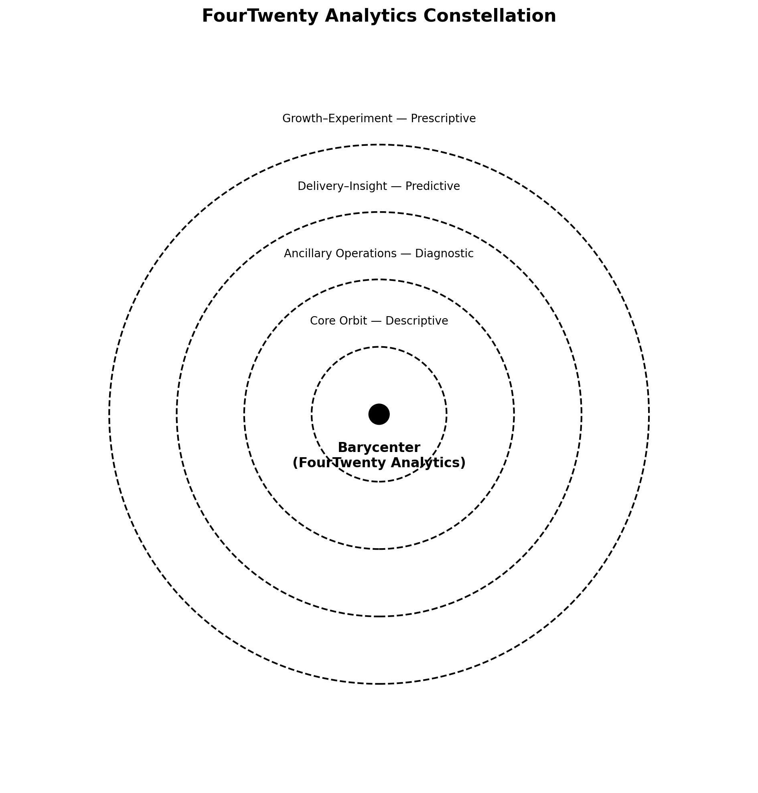

# FourTwenty Analytics — Modular Dashboard Sandbox

- My portfolio is structured as a modular sandbox I call FourTwenty Analytics.
- Each repository is a model within an orbit — 🚀 The Launch, 🫀 The Archive, 📡 The Signal, 🏦 The Bank, and others — that together simulate the systems a data analyst navigates in the real world.
- This lets me practice end-to-end craft: framing problems in YAML specs, validating with QA rules, pulsing with daily signals, and archiving immutable evidence.
- It's not just code; it's a living ecosystem where I sharpen analysis, consistency, and storytelling — the same skills I bring into a role.
- **Scrollkeeper Note** → My suns can wander all they want as long as 4/20 is seeded.

## Scaffolding

### Seeding

- `index.html`: portfolio website
- `README.md`: this scroll meant to be a running broadcast of how FourTwenty Analytics is built
- `hub_pat.md`: The constellation API token; while this is generally a secret, this portfolio is public facing, so there is no PII
- `assets/`: a set of images specific to FourTwenty Analytics
- `schemas/`: even living seeds need machine genetics; these .yml files define the seeds in machine language
- `seeds/`: a collection of data seeds meant to create a living system of modules; these seeds all maintain home repo genetics as the constellation grows
- `signals/`: a collection of constellation signals picked up by The Signal for broadcasting portfolio development
- `scripts/`: a collection of Python scripts intended to facilitate constellation processes
- `scrubs/`: a collection of QA scripts meant to periodically clean constellation data
- `.github/workflows/validate_seeds.yml`: validates seed structures against schemas

### Developmental Funnels

- `scrolls/`: A collection of creative writing scrolls meant for ideation

## Orbitals

### ☀️ Elemental System Creed

> The Elemental System is the epicenter of the constellation — the force that keeps every star aligned.

- 🔘 **The Barycenter** → presents **gravity**
  - All data seeds emanate from the hub

> This center exists so that all other stars exist.

### 🪐 Core System Creed

> The Core System consists of the stars that support metaphorical life for the constellation — the foundation that keeps every other orbit aligned.
> Each star has a distinct mission:

- 🫀 **The Archive** → promotes **longevity**
  - Breathes life into the constellation by maintaining memory, seeds, and history. Think master of the scrolls.

- 📡 **The Signal** → promotes **opportunity**
  - Acts as the nervous system — scanning outward and broadcasting inward to find value. Think curiosity.

- 🚀 **The Launch** → promotes **consistency**
  - Ensures new suns are seeded with repeatable, reliable foundations. Think genetic normalization.

- 🛡️ **The Protector** → promotes **integrity**
  - Safeguards the constellation by hardening workflows, monitoring health, and shortening recovery time. Think fortification and adaptability.

- ✨ **The Developer** → promotes **ideation**
  - Sparks new creations by shaping raw concepts into working modules, tools, and systems. Think genesis and invention.

> These Core stars work together so the constellation remains consistent, long-lived, opportunistic, and trustworthy.

### 📈 Delivery & Insight Creed

> The Delivery & Insight system consists of stars that translate data into meaning and action — the storytellers of the constellation.
> Each system has a distinct mission:

- 🎨 **The Visualizer** → promotes **clarity**
  - Paints data into patterns stakeholders can immediately grasp. Think canvas and gallery.

- ⚡ **The Catalyst** → promotes **transformation**
  - Accelerates change by turning insights into operational improvements. Think spark that ignites.

- 🏦 **The Bank** → promotes **stewardship**
  - Safeguards outputs and provides dashboards of record. Think vault of truth.

- 🧠 **The Evaluator** → promotes **judgment**
  - Weighs outcomes, models, and assumptions for sound decision-making. Think wisdom keeper.

- 📖 **The Story** → promotes **narrative**
  - Threads insights into human language that compels and convinces. Think bard of the constellation.

> These Delivery & Insight stars work together so the constellation always communicates clearly, acts decisively, and preserves trusted outcomes.

### 🧪 Growth & Experiment Creed

> The Growth & Experiment system consists of stars that push boundaries — where the constellation tests, plays, and evolves.
> Each system has a distinct mission:

- 🌱 **The Grower** → promotes **cultivation**
  - Nurtures seeds and modules to maturity. Think gardener's hand.

- 🎮 **The Player** → promotes **immersion**
  - Creates interactive spaces for experimentation. Think simulation and play.

- 🎲 **The Gambler** → promotes **risk & probability**
  - Models chance, odds, and uncertainty to explore outcomes. Think dice on the table.

- 🧭 **The Trainer** → promotes **discipline**
  - Sharpens skills and tracks progress across learning journeys. Think compass for growth.

- 💪 **The Coach** → promotes **resilience**
  - Builds habits, routines, and accountability. Think steady motivator.

> These Growth & Experiment stars work together so the constellation continuously learns, adapts, and expands its horizons.

### 🧩 Ancillary Operations Creed

> The Ancillary Operations system consists of stars that provide structure and support — the quiet strength beneath the constellation.
> Each system has a distinct mission:

- 🛰️ **The Orbiter** → promotes **perspective**
  - Circles the constellation, observing from distance and relaying balance. Think satellite eye.

- ⚓ **The Anchor** → promotes **stability**
  - Grounds the constellation when drift threatens alignment. Think ballast in the deep.

- 🏢 **The Firm** → promotes **governance**
  - Establishes rules, policies, and accountability. Think law of the land.

- 🪞 **The Mirror** → promotes **inner awareness**
  - Reflects strengths and weaknesses to guide improvement. Think honest reflection.

- 💰 **The Accountant** → promotes **fiscal responsibility**
  - Tracks resources, costs, and returns. Think ledger of sustainability.

> These Ancillary Operation stars work together so the constellation remains stable, governed, and sustainable across every orbit.

## 🌌 Constellation Architecture

The FourTwenty Analytics constellation follows a **four-tier orbital model** with the Barycenter at the center and specialized systems at increasing radii. This diagram illustrates the organizational structure and flow patterns across the analytical ecosystem.



*The constellation diagram shows the orbital classification system: Core Orbit (🪐) provides foundation services, Ancillary Operations (🧩) deliver structural support, Delivery–Insight (📈) transforms data into meaning, and Growth–Experiment (🧪) pushes boundaries through experimentation.*

**Orbital Characteristics:**

- **🔘 Barycenter**: Gravitational center housing all constellation primitives and governance
- **🪐 Core Orbit**: Foundation systems ensuring longevity, opportunity, consistency, integrity, and ideation
- **🧩 Ancillary Operations**: Support structures providing perspective, stability, governance, awareness, and fiscal responsibility  
- **📈 Delivery–Insight**: Translation systems promoting clarity, transformation, stewardship, judgment, and narrative
- **🧪 Growth–Experiment**: Innovation systems fostering cultivation, immersion, risk modeling, discipline, and resilience

*Generated using the `make_orbit_diagram.dib` notebook - a working example of executable documentation where running the code creates both the visualization and validates the constellation architecture.*

## Schemas

### schemas/glossary.schema.yml

```yaml
$schema: "https://json-schema.org/draft/2020-12/schema"
title: "glossary.yml schema"
type: array
description: "An array of glossary entry objects."
minItems: 1

items:
  type: object
  additionalProperties: false
  required: [key, term, definition]
  properties:
    key:
      type: string
      pattern: "^[a-z0-9_]+$"
      description: "Stable snake_case identifier"
    term:
      type: string
      minLength: 1
      description: "Human-readable label (usually Title Case)"
    definition:
      type: string
      minLength: 1
      description: "Plain-language explanation. Folded (>) YAML is fine."
    examples:
      type: array
      description: "Short, real uses (1–3 items)"
      items:
        type: string
        minLength: 1
    see_also:
      type: array
      description: "Related keys for cross-linking"
      items:
        type: string
        pattern: "^[a-z0-9_]+$"
```

### schemas/tags.schema.yml

```yaml
$schema: "https://json-schema.org/draft/2020-12/schema"
title: "tags seed"
type: array
items:
  type: object
  additionalProperties: false
  required: [key, label, description, kind, gloss_ref, deprecated]
  properties:
    key:
      type: string
      pattern: "^[a-z0-9_]+$"
      description: "Stable snake_case key"
    label:
      type: string
      minLength: 1
    description:
      type: string
      minLength: 1
    kind:
      type: string
      enum: ["analytics_type","audience","capability","concept","credential","discipline","format","framework","governance","knowledge","language","nav","navigation","organization","pipeline","planning","platform","practice","process","quality","repository","requirements","role","skills","source","standard","streaming","technique","module","topic","kpi","status","orbit","tech"]
    gloss_ref:
      type: string
      pattern: "^[a-z0-9_]+$"
    deprecated:
      type: boolean
```

### schemas/orbits.schema.yml

```yaml
$schema: "https://json-schema.org/draft/2020-12/schema"
title: "orbits.yml schema"
type: array
items:
  type: object
  additionalProperties: false
  required: [id, label, emoji, order]
  properties:
    id:
      type: string
      pattern: "^[a-z0-9_]+$"
    label:
      type: string
      minLength: 1
    emoji:
      type: string
      minLength: 1
    order:
      type: integer
      minimum: 0
    meaning:
      type: string
      description: "Purpose and high-level description of the orbital system"
    scope:
      type: array
      description: "Specific responsibilities and boundaries"
      items:
        type: string
        minLength: 1
    includes:
      type: array
      description: "Repositories or components within this orbital system"
      items:
        type: object
        properties:
          repo:
            type: string
            minLength: 1
        required: [repo]
    kpis:
      type: array
      description: "Key performance indicators for measuring orbital health"
      items:
        type: string
        minLength: 1
    policies:
      type: array
      description: "Governance rules and operational guidelines"
      items:
        type: string
        minLength: 1
    see_also:
      type: array
      description: "Related orbital systems for cross-reference"
      items:
        type: string
        pattern: "^[a-z0-9_-]+$"
```

### schemas/emoji_palette.schema.yml

```yaml
$schema: "https://json-schema.org/draft/2020-12/schema"
title: "emoji_palette.yml schema"
type: object
additionalProperties: false

# require at least status_icons; allow other icon groups as optional
required: [status_icons]
properties:
  status_icons:
    $ref: "#/$defs/iconMap"
  orbit_icons:
    $ref: "#/$defs/iconMap"
  module_icons:
    $ref: "#/$defs/iconMap"
  tech_icons:
    $ref: "#/$defs/iconMap"

$defs:
  # Generic map of snake_case keys -> emoji (string).
  # We don't regex-match emoji here because cross-platform emoji regex is brittle;
  # validators can enforce stricter checks separately if desired.
  iconMap:
    type: object
    minProperties: 1
    additionalProperties: false
    patternProperties:
      "^[a-z0-9_]+$":
        type: string
        minLength: 1
```

### schemas/statuses.schema.yml

```yaml
$schema: "https://json-schema.org/draft/2020-12/schema"
title: "statuses seed"
type: array
items:
  type: object
  additionalProperties: false
  required: [id, label, emoji, order, meaning, criteria, allowed_next]
  properties:
    id:
      type: string
      pattern: "^[a-z0-9_]+$"
    label:
      type: string
      minLength: 1
    emoji:
      type: string
      minLength: 1
    order:
      type: integer
      minimum: 0
    meaning:
      type: string
      minLength: 1
    criteria:
      type: array
      items: { type: string }
    allowed_next:
      type: array
      items: { type: string }
```

### schemas/funnel_spec.schema.yml

```yaml
$schema: "https://json-schema.org/draft/2020-12/schema"
title: "funnel_spec.yml schema"
type: object
additionalProperties: false
required: [version, funnels]

properties:
  version:
    type: integer
    minimum: 1

  defaults:
    type: object
    additionalProperties: false
    properties:
      timezone:
        type: string
        # Keep this permissive (IANA e.g., "UTC", "America/New_York")
        pattern: "^[A-Za-z0-9_+./-]+$"
      sla:
        $ref: "#/$defs/slaSpec"
      metrics:
        type: array
        items:
          type: object
          additionalProperties: false
          required: [id, description]
          properties:
            id:
              $ref: "#/$defs/snakeId"
            description:
              type: string
              minLength: 1

  funnels:
    type: array
    minItems: 1
    items:
      $ref: "#/$defs/funnelSpec"

$defs:
  snakeId:
    type: string
    pattern: "^[a-z0-9_]+$"

  slaSpec:
    type: object
    additionalProperties: false
    properties:
      # At least one max_* should be provided when SLA is present
      max_days_in_step:
        type: integer
        minimum: 0
      max_hours_in_step:
        type: integer
        minimum: 0
      max_minutes_in_step:
        type: integer
        minimum: 0
      breach_severity:
        type: string
        enum: [warn, error]
      breach_tag:
        $ref: "#/$defs/snakeId"
    anyOf:
      - required: [max_days_in_step]
      - required: [max_hours_in_step]
      - required: [max_minutes_in_step]

  stepSpec:
    type: object
    additionalProperties: false
    required: [id, label]
    properties:
      id:        { $ref: "#/$defs/snakeId" }
      label:     { type: string, minLength: 1 }
      description: { type: string }
      requires:
        type: array
        items: { type: string, minLength: 1 }
      next:
        type: array
        items: { $ref: "#/$defs/snakeId" }
      exit_to:
        type: array
        items: { $ref: "#/$defs/snakeId" }
      steady_state: { type: boolean }
      terminal:     { type: boolean }
      urgent:       { type: boolean }
      remediation:
        type: array
        items: { type: string, minLength: 1 }
      sla:
        $ref: "#/$defs/slaSpec"
    allOf:
      # Prevent a step from being both steady_state and terminal
      - not:
          allOf:
            - required: [steady_state]
            - required: [terminal]
            - properties:
                steady_state: { const: true }
                terminal:     { const: true }

  funnelSpec:
    type: object
    additionalProperties: false
    required: [id, label, entity, steps]
    properties:
      id:         { $ref: "#/$defs/snakeId" }
      label:      { type: string, minLength: 1 }
      entity:     { type: string, minLength: 1 }
      key_field:  { type: string, minLength: 1 }
      description:{ type: string }
      steps:
        type: array
        minItems: 1
        items: { $ref: "#/$defs/stepSpec" }
```

### schemas/latest.schema.yml

```yaml
# schemas/latest.schema.yml
title: "latest.json schema"
type: object
additionalProperties: false

required:
  - id
  - ts_utc
  - module
  - repo
  - title
  - summary
  - rating
  - origin
  - links
  - payload

properties:
  id:
    type: string
    description: "Globally unique id, e.g. YYYYMMDDTHHMMSSZ-<repo>-<slug>"
    pattern: "^[a-z0-9\\-T:Z_]+$"
  ts_utc:
    type: string
    format: date-time
    description: "UTC timestamp when this broadcast was created"
  date:
    type: string
    description: "Convenience YYYY-MM-DD derived from ts_utc"
    pattern: "^\\d{4}-\\d{2}-\\d{2}$"
  module:
    type: string
    description: "Human-facing module/sun name, e.g. The Signal"
  repo:
    type: string
    description: "Repo slug, e.g. signal-model"
    pattern: "^[a-z0-9\\-]+$"
  title:
    type: string
  summary:
    type: string
  tags:
    type: array
    items:
      type: string
  rating:
    type: string
    enum: [critical, high, normal, mundane]
    description: "Broadcast severity/importance"
  origin:
    type: object
    additionalProperties: false
    required: [name, url, emoji]
    properties:
      name:
        type: string
        description: "Branding block title, e.g. FourTwenty Analytics"
      url:
        type: string
        description: "Canonical page for this module/repo"
      emoji:
        type: string
        description: "Single emoji glyph for the module"
  links:
    type: object
    additionalProperties: false
    properties:
      readme:
        type: string
      page:
        type: string
      data:
        type: string
      runbook:
        type: string
  payload:
    type: object
    description: "Free-form JSON payload for module-specific details"
  checksum:
    type: string
    description: "Optional content hash for integrity checks"
  version:
    type: string
    description: "Semantic version of this broadcast schema/content"
```

### schemas/modules.schema.yml

```yaml
$schema: "https://json-schema.org/draft/2020-12/schema"
title: "modules.yml schema"
type: array
items:
  type: object
  additionalProperties: false
  required: [key, repo, orbit, status]
  properties:
    key:
      type: string
      pattern: "^[a-z0-9_]+$"
      description: "Stable snake_case module key"
    label:
      type: string
      minLength: 1
    repo:
      type: string
      pattern: "^[A-Za-z0-9._-]+$"
      description: "Repository name (e.g., bank-model)"
    owner:
      type: string
      pattern: "^[A-Za-z0-9-]{1,39}$"
      description: "GitHub owner/org (optional if full_name used)"
    full_name:
      type: string
      pattern: "^[A-Za-z0-9-]{1,39}/[A-Za-z0-9._-]+$"
      description: "owner/repo (optional alternative to owner+repo)"
    orbit:
      type: string
      pattern: "^[a-z0-9_]+$"
    status:
      type: string
      pattern: "^[a-z0-9_]+$"
    emoji:
      type: string
      minLength: 1
    live_url:
      type: string
      pattern: "^https?://.+"
    description:
      type: string
    tags:
      type: array
      items:
        type: string
        pattern: "^[a-z0-9_]+$"
    contacts:
      type: array
      items:
        type: string
        minLength: 1
    created_at:
      type: string
      pattern: "^[0-9]{4}-[0-9]{2}-[0-9]{2}T[0-9]{2}:[0-9]{2}:[0-9]{2}Z$"
      description: "ISO8601 UTC, e.g. 2025-09-09T12:34:56Z"
    updated_at:
      type: string
      pattern: "^[0-9]{4}-[0-9]{2}-[0-9]{2}T[0-9]{2}:[0-9]{2}:[0-9]{2}Z$"
allOf:
  - if:
      properties:
        full_name: { type: string }
    then:
      properties: {}
    else:
      required: [owner]
```

### schemas/seedset.schema.yml

```yaml
$schema: "https://json-schema.org/draft/2020-12/schema"
title: "seedset.yml schema"
type: object
additionalProperties: false

required: [files]
properties:
  # Required: the files to fan-out into each repo (relative paths)
  files:
    type: array
    minItems: 1
    items:
      type: string
      # allow common roots + common extensions you’re using
      pattern: "^(seeds|schema|signals|root|data|scripts|web|\\.github)/[A-Za-z0-9._/\\-]+\\.(ya?ml|json|md|html|js|csv)$"

  # Optional: directories to ensure exist before copying
  dirs:
    type: array
    items:
      type: string
      pattern: "^(seeds|schema|signals|root|data|scripts|web|\\.github)(/[A-Za-z0-9._\\-]+)*$"

  # Optional: explicit copy mappings (e.g., from a templates folder)
  copy:
    type: array
    items:
      type: object
      additionalProperties: false
      required: [from, to]
      properties:
        from:
          type: string
          pattern: "^(templates|root|schema|seeds|web|scripts|data)/[A-Za-z0-9._/\\-]+$"
        to:
          type: string
          pattern: "^[A-Za-z0-9._/\\-]+$"

  # Optional: token replacements your scaffolder can apply (e.g., owner/repo)
  variables:
    type: object
    additionalProperties:
      type: string
```

## Seeds

### seeds/glossary.yml

```yaml
# Field descriptions:
# - key: Stable, machine-friendly identifier in snake_case. Must be unique and should never change (other files may reference it).
# - term: Human-readable label (usually Title Case). Safe to tweak for wording, since references should point to key, not term.
# - definition: Plain-language explanation for humans. Use > (folded block) so it reads as one paragraph. Start with a crisp one-sentence summary; add a second line for nuance if needed.
# - examples: Short, real uses (1–3 items). Each item is a concise string that shows the term in context—an action, artifact, or sentence fragment.
# - see_also: List of related keys (not terms). Helps cross-link concepts within your docs.

- key: portfolio
  term: "Portfolio"
  definition: >
    Content intended for external viewing (landing pages, demos, docs).
    Aggregates public entry points across modules.
  examples:
    - "Launch Model GitHub Pages site"
  see_also: ["launch", "entry"]
```

### seeds/tags.yml

```yaml
# Field descriptions:
# - key: Stable, machine-friendly identifier in snake_case. Must be unique and should not change (dashboards and docs may reference it).
# - label: Human-readable display name (Title Case). Safe to tweak without breaking references (consumers should point to key).
# - description: Plain-language summary for humans. Use > (folded block) so it reads as one paragraph. Start with a crisp one-sentence summary; add an optional second line for nuance.
# - kind: Category for grouping/filters. Choose one from the allowed set: ["analytics_type","audience","capability","concept","credential","discipline","format","framework","governance","knowledge","language","nav","navigation","organization","pipeline","planning","platform","practice","process","quality","repository","requirements","role","skills","source","standard","streaming","technique","module","topic","kpi","status","orbit","tech"]
# - gloss_ref: The key of a related entry in seeds/glossary.yml. Validates cross-linking and keeps tags fewer than glossary terms.
# - deprecated: Boolean flag. Set to true to retire a tag without breaking older artifacts; prefer introducing a replacement tag and updating references over time.

- key: portfolio
  label: "Portfolio"
  description: >
    Public-facing entry artifacts across the constellation.
  kind: orbit
  gloss_ref: portfolio
  deprecated: false
```

**Notes:** Keep tags.yml intentionally smaller than glossary.yml; use it as the cross-module "integration surface." When in doubt, put specifics in the glossary and map them to a broader tag via gloss_ref.

### seeds/orbits.yml

```yaml
# Field descriptions:
# - id: Unique identifier in snake_case. Stable reference for cross-linking and validation. [REQUIRED]
# - label: Human-readable name (Title Case). Display-friendly orbital system name. [REQUIRED]
# - emoji: Visual identifier. Single Unicode character for UI representation. [REQUIRED]
# - order: Sort order. Integer for consistent constellation arrangement. [REQUIRED]
# - meaning: Purpose and high-level description of the orbital system. One-sentence summary of the orbit's role. [STRONGLY RECOMMENDED]
# - scope: Specific responsibilities and boundaries. Array of operational focus areas within this orbit. [STRONGLY RECOMMENDED]
# - includes: Repositories or components within this orbital system. Array of objects with repo property for constellation mapping. [STRONGLY RECOMMENDED]
# - kpis: Key performance indicators for measuring orbital health. Array of metrics for tracking system effectiveness. [STRONGLY RECOMMENDED]
# - policies: Governance rules and operational guidelines. Array of standards and procedures for orbit management. [STRONGLY RECOMMENDED]
# - see_also: Related orbital systems for cross-reference. Array of orbit IDs for navigation and context. [OPTIONAL]

- id: elemental-system
  label: "Elemental System"
  emoji: "☀️"
  order: 0
  meaning: "The hub repo housing primitives—seeds, artifacts, README, and public index."
  scope:
    - "Hub README.md and index.html (portfolio entry)"
    - "Canonical seed definitions (glossary.yml, tags.yml, statuses.yml, orbits.yml, registry.yml)"
    - "Shared assets, scaffolds, and templates"
    - "Governance notes and contribution guidelines"
  includes:
    - repo: "FourTwentyAnalytics"  # 🔘 barycenter & suitekeeper
  kpis:
    - "Seed schema validity (lint/CI passing)"
    - "Cross-repo seed compliance rate"
    - "Hub uptime and README freshness"
    - "Index render health (README/Pages load without errors)"
  policies:
    - "Schema changes require version bump and migration notes"
    - "Hub remains public; CI must pass before merge"
    - "Backwards-compatible deprecations for seed keys"
  see_also: ["core", "delivery-insight", "growth-experiment", "ancillary-operations"]
```

### seeds/emoji_palette.yml

```yaml
# Field descriptions:
# - status_icons: Map of status/state identifiers to emoji representations. Used for progress indicators and workflow states.
# - orbit_icons: Map of orbital system identifiers to emoji representations. Used for constellation navigation and visual organization.
# - module_icons: Map of module/repository identifiers to emoji representations. Used for project identification and branding.
# - tech_icons: Map of technology/tool identifiers to emoji representations. Used for tech stack visualization and documentation.

status_icons:
  seed: "🌱"
  sprout: "🌿"
  active: "🟢"
  pending: "🟡"
  error: "🔴"

orbit_icons:
  elemental_system: "☀️"
  core_system: "🪐"
  delivery_insight: "📈"
  growth_experiment: "🧪"
  ancillary_operations: "🧩"
  
module_icons:
  fourtwenty_analytics: "🔘"
  launch_model: "🚀"
  archive_model: "🫀"
  signal_model: "📡"
  protector_model: "🛡️"

tech_icons:
  python: "🐍"
  javascript: "⚡"
  yaml: "📄"
  json: "🔧"
  sql: "🗃️"
  docker: "📦"
  aws: "☁️"
```

### seeds/statuses.yml

```yaml
# Field descriptions:
# - id: Unique identifier in snake_case. Stable reference for cross-linking and validation.
# - label: Human-readable name (Title Case). Display-friendly status name for UI and reports.
# - emoji: Visual identifier. Single Unicode character for status representation in dashboards and workflows.
# - order: Sort order. Integer for consistent status progression and lifecycle visualization.
# - meaning: Purpose and high-level description of the status. One-sentence summary of what this status represents in the module lifecycle.
# - criteria: Specific requirements and conditions. Array of measurable conditions that must be met to achieve this status.
# - allowed_next: Valid status transitions. Array of status IDs that can follow this status in the workflow progression.

- id: seed
  label: "Seed"
  emoji: "🌱"
  order: 01
  meaning: "Idea captured; repo exists; README stub."
  criteria: ["repo_created", "readme_stub"]
  allowed_next: ["sprout"]

- id: sprout
  label: "Sprout"
  emoji: "🌿"
  order: 02
  meaning: "Scaffold working; basic demo or notebook runs."
  criteria: ["scaffold_ready", "seeds_defined", "hello_world_demo"]
  allowed_next: ["budding", "dormant"]
```

### seeds/funnel_spec.yml

```yaml
# Field descriptions:
# - version: Schema version (integer). Used for compatibility checks and migrations.
# - defaults: Global settings applied when not specified at the funnel/step level.
#   - timezone: IANA timezone string. Used for all timestamp math and SLA calculations.
#   - sla: Default SLA breach policy. Applied to any step without its own SLA block.
#     - breach_severity: Breach impact level. One of [warn|error]; drives validator behavior.
#     - breach_tag: Tag emitted on breach. Lets validators annotate offending records.
#   - metrics: Derived KPIs the validator can compute from timestamps present in the data.
#     - id: Metric identifier in snake_case. Stable key for dashboards and exports.
#     - description: Plain-English metric definition. One-liner explaining the calculation.
#
# - funnels: Collection of funnel specifications. Each describes a lifecycle for one entity type.
#   - id: Unique identifier in snake_case. Stable reference for cross-linking and validation.
#   - label: Human-readable name (Title Case). Display-friendly funnel name for UI and reports.
#   - entity: Record type moving through the funnel. Used to join against your source tables.
#   - key_field: Field path that holds the current step (e.g., "status" or "status/conclusion").
#   - description: Purpose and scope of the funnel. One-sentence summary of what it models.
#   - steps: Ordered list of discrete steps in the funnel lifecycle.
#     - id: Step identifier in snake_case. Stable reference for transitions and metrics.
#     - label: Human-readable step name (Title Case). Shown in charts and step summaries.
#     - requires: Preconditions to enter the step. Array of signals/flags your validator checks.
#     - next: Valid step transitions. Array of step IDs allowed to follow this step.
#     - sla: Time expectations for this step. Overrides defaults.sla when present.
#       - max_days_in_step: Maximum days allowed to dwell in this step before breach.
#       - max_minutes_in_step: Maximum minutes allowed (useful for fast CI pipelines).
#       - breach_severity: Optional override of breach impact level for this step.
#       - breach_tag: Optional override of the tag emitted on breach for this step.
#
# Notes:
# - Steps are evaluated in the order listed to compute dwell time and transitions.
# - If both max_days_in_step and max_minutes_in_step are provided, the stricter limit applies.
# - Lead/cycle time metrics use the first observed step as the start and honor any paused/dormant
#   semantics your validator recognizes when computing time exclusions.

version: 1
defaults:
  timezone: "UTC"
  sla:
    breach_severity: warn         # warn | error
    breach_tag: "sla_breach"      # tag your validator can emit
  metrics:
    # your validator can compute these from timestamps it sees in data
    - id: lead_time_days
      description: "Time from first funnel step to first steady_state step"
    - id: cycle_time_days
      description: "Time spent between non-terminal steps (excludes paused/dormant)"
    - id: time_in_step_days
      description: "Per-step dwell time"

funnels:
  # ---------------------------------------------------------------------------
  - id: launch_lifecycle
    label: "Module Lifecycle"
    entity: "module"
    key_field: "status"    # your modules.yml uses these keys
    description: "End-to-end lifecycle for constellation modules (FourTwenty)."
    steps:
      - id: queued
        label: "Queued"
        requires: ["proposal_issue_open", "rough_tshirt_size"]
        next: ["seed", "scoped"]
        sla: { max_days_in_step: 14, breach_severity: warn }
 # ---------------------------------------------------------------------------
  - id: workflow_run
    label: "GitHub Workflow Run"
    entity: "workflow_run"
    key_field: "status/conclusion"
    description: "CI pipeline health funnel for Actions runs."
    steps:
      - id: queued
        label: "Queued"
        next: ["in_progress", "cancelled"]
        sla: { max_minutes_in_step: 10 }

      - id: in_progress
        label: "In Progress"
        next: ["success", "failure", "cancelled", "timed_out"]
        sla: { max_minutes_in_step: 20 }
```

### seeds/seed.latest.json

```yaml
# Field descriptions:
# - id: Unique identifier (string). Timestamp + repo + type; ensures stable reference across pulses.
# - ts_utc: Event timestamp in UTC (ISO 8601). Canonical time anchor for sorting and metrics.
# - date: Calendar date (YYYY-MM-DD). Readable date key for grouping, reporting, and partitioning.
# - module: Name of the constellation module (string). High-level system or star this seed belongs to.
# - repo: Repository slug (string). GitHub repo identifier for traceability back to source code.
# - title: Short event title (string). Human-friendly name summarizing the broadcast or record.
# - summary: One-sentence narrative. Explains what happened or why the seed exists.
# - tags: Array of keywords (list of strings). Used for classification, filtering, and search.
# - rating: Qualitative priority/impact (string). Values like [low|medium|high]; used to flag importance.
# - origin: Source metadata block. Captures who/where the seed came from.
#   - name: Display name of origin system or module.
#   - url: Canonical link back to origin.
#   - emoji: Visual marker for the origin system.
# - links: Related references. Keyed URLs pointing to canonical docs, pages, or datasets.
#   - readme: Repository README link.
#   - page: GitHub Pages site or demo link.
#   - data: Direct link to raw or aggregated data.
#   - runbook: Link to troubleshooting/operational runbook.
# - payload: Arbitrary content block. Flexible JSON for notes, details, or additional context.
#   - notes: Freeform explanatory text attached to this broadcast.
# - checksum: Integrity hash (string). Optional field to validate payload consistency.
# - version: Schema or payload version (string). Used for compatibility and migration management.

{
  "id": "2025-09-10T20:00:00Z-fourtwentyanalytics-broadcast-seed",
  "ts_utc": "2025-09-10T20:00:00Z",
  "date": "2025-09-10",
  "module": "FourTwentyAnalytics",
  "repo": "fourtwentyanalytics",
  "title": "Master star broadcast seed initialized",
  "summary": "Bootstrapped constellation broadcasting: schema, nightly pulse, and Signal renderer.",
  "tags": ["broadcasting", "schema", "renderer", "pulse"],
  "rating": "high",
  "origin": {
    "name": "FourTwenty Analytics",
    "url": "https://zbreeden.github.io/FourTwentyAnalytics/",
    "emoji": "🔘"
  },
  "links": {
    "readme": "https://github.com/zbreeden/fourtwentyanalytics#readme",
    "page": "https://zbreeden.github.io/fourtwentyanalytics/",
    "data": "https://github.com/zbreeden/fourtwentyanalytics/tree/main/signals",
    "runbook": "https://github.com/zbreeden/fourtwentyanalytics/blob/main/RUNBOOK.md"
  },
  "payload": {
    "notes": "This is the top-level aggregator in FourTwentyAnalytics. Nightly pulse pulls latest.json from each star."
  },
  "checksum": "",
  "version": "1.0.0"
}
```

### seeds/modules.yml

```yaml
# Field descriptions:
# - id: Unique identifier in snake_case. Stable key for cross-linking across seeds and schemas.
# - name: Human-readable module name. May include nickname or role in parentheses for clarity.
# - emoji: Visual identifier. Single Unicode character representing the module in dashboards, UIs, and diagrams.
# - orbit: System orbit classification. One of [core|elemental-system|auxiliary|delivery|evaluation|firm] describing the module’s placement in the constellation.
# - status: Lifecycle state of the module. Current value aligned to statuses.yml (e.g., seed, sprout, active, dormant).
# - tags: Array of topical keywords. Used for categorization, filtering, and search across modules.
# - glyphs: Array of symbolic markers. Cross-links to glyph definitions for visual and conceptual grouping.
# - repo_url: GitHub repository URL. Canonical codebase location for the module.
# - pages_url: GitHub Pages URL. Public-facing demo or documentation site for the module.
# - owners: Array of maintainer IDs. References to individuals or teams responsible for the module.

- key: fourtwenty_analytics
  label: "FourTwenty Analytics (The Barycenter)"
  repo: "FourTwentyAnalytics"
  owner: "zbreeden"
  emoji: "🔘"
  orbit: elemental-system
  status: active
  tags: [hub, seeds, portfolio, index]
  glyphs: [hub]
  repo_url: https://github.com/zbreeden/FourTwentyAnalytics
  pages_url: https://zbreeden.github.io/FourTwentyAnalytics/
  owners: [zach]

# ── Core Systems ────────────────────────────────────────────────────────────────

- key: archive_model
  label: "Archive Model"
  repo: "archive-model"
  owner: "zbreeden"
   emoji: "🫀"
  orbit: core_system
  status: active
  tags: [records, glossary, tags, statuses]
  glyphs: [archive, hub, signal]
  repo_url: https://github.com/zbreeden/archive-model
  pages_url: https://zbreeden.github.io/archive-model/
  owners: [zach]
```

### seeds/seedset.yml

```yaml
# Files to push into every module repo (relative to repo root)
files:
  - seeds/emoji_palette.yml
  - seeds/orbits.yml
  - seeds/tags.yml
  - seeds/glossary.yml
  - seeds/statuses.yml
  - seeds/modules.yml
  - seeds/seed.latest.json
  - seeds/seedset.yml
  - signals/latest.json
  - schema/emoji_palette.schema.yml
  - schema/funnel_spec.schema.yml
  - seeds/funnel_spec.yml
  - schema/glossary.schema.yml
  - schema/latest.schema.yml
  - schema/modules.schema.yml
  - schema/orbits.schema.yml
  - schema/seedset.schema.yml
  - schema/statuses.schema.yml
  - schema/tags.schema.yml
  - root/README.md
  - root/index.html
```

## Scripts

### scripts/new-module.sh

An interactive script for creating new constellation stars (modules) with complete scaffolding, validation, and hub integration.

```bash
#!/usr/bin/env bash
set -euo pipefail

echo "🌌 Create a new FourTwenty Analytics constellation star"
echo "This creates a standalone repository scaffold for a new module."
echo

read -rp "Module title (e.g., 'Signal Model'): " TITLE

# Get and validate module key with retry loop
while :; do
  read -rp "Module key (snake_case, e.g., 'signal_model'): " MODULE_KEY
  if [ -z "$MODULE_KEY" ]; then
    echo "❌ Module key cannot be empty. Please try again."
    continue
  fi
  if ! printf "%s" "$MODULE_KEY" | grep -Eq '^[a-z0-9_]+$'; then
    echo "❌ Invalid module key. Use lowercase letters, digits, and underscores only. Please try again."
    continue
  fi
  # Check if module key already exists in seeds/modules.yml
  if [ -f "seeds/modules.yml" ] && grep -q "key: $MODULE_KEY" "seeds/modules.yml"; then
    echo "❌ Module key '$MODULE_KEY' already exists in seeds/modules.yml. Please choose a different key."
    continue
  fi
  break
done

# Get and validate repo name with retry loop
while :; do
  read -rp "Repository name (kebab-case, e.g., 'signal-model'): " REPO_NAME
  if [ -z "$REPO_NAME" ]; then
    echo "❌ Repository name cannot be empty. Please try again."
    continue
  fi
  if ! printf "%s" "$REPO_NAME" | grep -Eq '^[a-z0-9-]+$'; then
    echo "❌ Invalid repo name. Use lowercase letters, digits, and hyphens only. Please try again."
    continue
  fi
  # Check if directory already exists
  if [ -d "$REPO_NAME" ]; then
    echo "❌ Directory '$REPO_NAME' already exists. Please choose a different name."
    continue
  fi
  break
done

read -rp "Short description: " DESC

# Set BASE directory name
BASE="$REPO_NAME"

# Prompt for orbital classification
echo "Available orbital systems:"
if [ -f "seeds/orbits.yml" ]; then
  # Extract orbit IDs and labels for display
  grep -E "^- id:|^  label:" seeds/orbits.yml | sed 'N;s/\n/ /' | sed 's/^- id: /  /' | sed 's/  label: / -> /'
else
  echo "  core -> Core Systems"
  echo "  delivery-insight -> Delivery & Insight" 
  echo "  growth-experiment -> Growth & Experiment"
  echo "  ancillary-operations -> Ancillary Operations"
fi
echo
read -rp "Orbital classification (e.g., 'core'): " ORBIT

# Prompt for status
echo "Available statuses:"
if [ -f "seeds/statuses.yml" ]; then
  grep -E "^- id:|^  label:" seeds/statuses.yml | sed 'N;s/\n/ /' | sed 's/^- id: /  /' | sed 's/  label: / -> /'
else
  echo "  seed -> Seed"
  echo "  sprout -> Sprout"
  echo "  developing -> Developing"  
  echo "  active -> Active"
fi
echo
read -rp "Status (default: 'seed'): " STATUS
STATUS=${STATUS:-seed}

# Prompt for an emoji and validate against seeds/emoji_palette.yml if present
EMOJI=""
if [ -f "seeds/emoji_palette.yml" ]; then
  echo "Available emoji icons (from seeds/emoji_palette.yml):"
  # Parse module_icons section
  awk '/^module_icons:/{flag=1; next} /^[a-z_]+:/{flag=0} flag && /^  / {gsub(/[": ]/, "", $2); print "  " $1 " -> " $2}' seeds/emoji_palette.yml
  echo

  while :; do
    read -rp "Emoji (paste glyph, e.g. 🔘) [enter to skip]: " EMOJI
    # Allow skip
    if [ -z "$EMOJI" ]; then
      break
    fi
    # Check if glyph already exists in palette - inform but allow
    if grep -Fq -- "$EMOJI" seeds/emoji_palette.yml; then
      echo "ℹ️ Note: '$EMOJI' is already defined in seeds/emoji_palette.yml, but proceeding anyway."
    fi
    break
  done
else
  read -rp "Emoji (paste glyph, e.g. 🔘) [enter to skip]: " EMOJI || true
fi

# If a new emoji was provided, add it to seeds/emoji_palette.yml under module_icons
if [ -n "${EMOJI:-}" ]; then
  if [ ! -f "seeds/emoji_palette.yml" ]; then
    mkdir -p seeds
    cat > seeds/emoji_palette.yml <<YML
module_icons:
  ${MODULE_KEY}: "$EMOJI"

status_icons:
  seed: "🌱"
  sprout: "🌿"
  active: "🟢"
  pending: "🟡" 
  error: "🔴"
YML
    echo "✅ Created seeds/emoji_palette.yml and added ${MODULE_KEY} -> $EMOJI"
  else
    # Add to existing module_icons section
    if grep -q '^module_icons:' seeds/emoji_palette.yml; then
      # Find insertion point (before next section or EOF)
      if grep -q '^status_icons:' seeds/emoji_palette.yml; then
        lineno=$(grep -n '^status_icons:' seeds/emoji_palette.yml | head -1 | cut -d: -f1)
        tmp=$(mktemp)
        head -n $((lineno-1)) seeds/emoji_palette.yml > "$tmp"
        printf '  %s: "%s"\n' "${MODULE_KEY}" "$EMOJI" >> "$tmp"
        tail -n +$lineno seeds/emoji_palette.yml >> "$tmp"
        mv "$tmp" seeds/emoji_palette.yml
      else
        printf '  %s: "%s"\n' "${MODULE_KEY}" "$EMOJI" >> seeds/emoji_palette.yml
      fi
    else
      # Prepend module_icons section
      tmp=$(mktemp)
      printf 'module_icons:\n  %s: "%s"\n\n' "${MODULE_KEY}" "$EMOJI" > "$tmp"
      cat seeds/emoji_palette.yml >> "$tmp"
      mv "$tmp" seeds/emoji_palette.yml
    fi
    echo "✅ Added ${MODULE_KEY} -> $EMOJI to seeds/emoji_palette.yml"
  fi
fi

echo
echo "🏗️ Creating constellation star scaffold..."

# Create base directory structure according to seedset.yml
mkdir -p "$BASE"/{seeds,schema,signals,scripts,assets,data,scrubs}

# Create main README.md
cat > "$BASE/README.md" <<EOF
# $TITLE

> **$DESC**

## 🌌 Constellation Information

- **Module Key**: \`$MODULE_KEY\`  
- **Repository**: \`$REPO_NAME\`
- **Orbit**: \`$ORBIT\`
- **Status**: \`$STATUS\`
- **Emoji**: $EMOJI

## 🚀 Quick Start

1. **Review seeds/**: Adapt seeded data for this module
2. **Configure schemas/**: Update schema definitions as needed  
3. **Generate signals/**: Create latest.json broadcast file
4. **Run validation**: \`scripts/validate.sh\`

## 📡 Broadcasting

This module produces a \`signals/latest.json\` file conforming to the constellation's broadcast schema. The Signal (📡) aggregates these across all stars.

## 🔗 Constellation Links

- **Hub**: [FourTwenty Analytics](https://github.com/zbreeden/FourTwentyAnalytics)
- **Archive**: Glossary, tags, and canonical definitions
- **Signal**: Cross-constellation broadcasting and telemetry

---

*This star is part of the FourTwenty Analytics constellation - a modular analytics sandbox where each repository is a specialized "model" within an orbital system.*
EOF

# Create index.html for GitHub Pages
cat > "$BASE/index.html" <<EOF
<!doctype html>
<html lang="en">
<head>
  <meta charset="utf-8">
  <meta name="viewport" content="width=device-width, initial-scale=1">
  <title>$TITLE - FourTwenty Analytics</title>
  <meta name="description" content="$DESC">
  <link rel="icon" href="data:image/svg+xml,<svg xmlns='http://www.w3.org/2000/svg' viewBox='0 0 100 100'><text y='0.9em' font-size='90'>$EMOJI</text></svg>">
</head>
<body>
  <header>
    <h1>$EMOJI $TITLE</h1>
    <p>$DESC</p>
    <nav>
      <a href="https://github.com/zbreeden/$REPO_NAME">Repository</a> |
      <a href="https://github.com/zbreeden/FourTwentyAnalytics">Hub</a>
    </nav>
  </header>
  
  <main>
    <section>
      <h2>🌌 Constellation Info</h2>
      <ul>
        <li><strong>Orbit</strong>: $ORBIT</li>
        <li><strong>Status</strong>: $STATUS</li>  
        <li><strong>Module Key</strong>: <code>$MODULE_KEY</code></li>
      </ul>
    </section>
    
    <section>
      <h2>📡 Latest Signal</h2>
      <p><em>Broadcast data will appear here when signals/latest.json is generated.</em></p>
    </section>
  </main>
  
  <footer>
    <p>Part of the <a href="https://zbreeden.github.io/FourTwentyAnalytics/">FourTwenty Analytics</a> constellation</p>
  </footer>
</body>
</html>
EOF

# Copy seedset files according to seeds/seedset.yml
echo "📦 Distributing seedset files..."
if [ -f "seeds/seedset.yml" ]; then
  # Read files list from seedset.yml and copy them
  grep -A 100 "^files:" seeds/seedset.yml | grep "^  - " | sed 's/^  - //' | while read -r file_path; do
    # Handle directories (end with /)
    if [[ "$file_path" == */ ]]; then
      mkdir -p "$BASE/$file_path"
      echo "  ✓ Created directory: $file_path"
      continue
    fi
    
    # Handle file paths - try multiple source locations
    source_file=""
    if [ -f "$file_path" ]; then
      source_file="$file_path"
    elif [ -f "${file_path//schema\//schemas/}" ]; then
      # Handle schema/ vs schemas/ mismatch
      source_file="${file_path//schema\//schemas/}"
    fi
    
    if [ -n "$source_file" ]; then
      target_dir="$BASE/$(dirname "$file_path")"
      mkdir -p "$target_dir"
      cp "$source_file" "$BASE/$file_path"
      echo "  ✓ $file_path"
    else
      echo "  ⚠️ Missing: $file_path"
      # Create directory structure even if file is missing
      target_dir="$BASE/$(dirname "$file_path")"
      mkdir -p "$target_dir"
    fi
  done
else
  echo "  ⚠️ No seeds/seedset.yml found, copying seeds manually..."
  if [ -d "seeds" ]; then
    cp seeds/*.yml "$BASE/seeds/" 2>/dev/null || true
    cp seeds/*.json "$BASE/seeds/" 2>/dev/null || true
  fi
  if [ -d "schemas" ]; then
    cp schemas/*.yml "$BASE/schema/" 2>/dev/null || true
  fi
fi

# Create initial signals/latest.json
cat > "$BASE/signals/latest.json" <<EOF
{
  "id": "$(date -u +%Y%m%dT%H%M%SZ)-${REPO_NAME}-genesis",
  "ts_utc": "$(date -u +%Y-%m-%dT%H:%M:%SZ)",
  "date": "$(date -u +%Y-%m-%d)",
  "module": "$TITLE",
  "repo": "$REPO_NAME", 
  "title": "New constellation star initialized",
  "summary": "Generated module scaffold with seedset distribution and basic broadcast structure.",
  "tags": ["genesis", "scaffold", "module", "$ORBIT"],
  "rating": "normal",
  "origin": {
    "name": "$TITLE",
    "url": "https://zbreeden.github.io/$REPO_NAME/",
    "emoji": "$EMOJI"
  },
  "links": {
    "readme": "https://github.com/zbreeden/$REPO_NAME#readme",
    "page": "https://zbreeden.github.io/$REPO_NAME/",
    "data": "https://github.com/zbreeden/$REPO_NAME/tree/main/signals",
    "runbook": "https://github.com/zbreeden/$REPO_NAME/blob/main/RUNBOOK.md"
  },
  "payload": {
    "orbit": "$ORBIT",
    "status": "$STATUS", 
    "module_key": "$MODULE_KEY",
    "notes": "Initial scaffold created by new-module.sh script. Ready for customization and development."
  },
  "checksum": "",
  "version": "1.0.0"
}
EOF

# Create validation script
cat > "$BASE/scripts/validate.sh" <<'EOF'
#!/usr/bin/env bash
set -euo pipefail

MODULE_DIR="$(cd "$(dirname "${BASH_SOURCE[0]}")/.." && pwd)"
echo "🔍 Validating module: $(basename "$MODULE_DIR")"

# Check required files exist
echo "📁 Checking required files..."
required_files=(
  "README.md"
  "index.html"
  "signals/latest.json"
  "seeds/modules.yml"
  "schema/latest.schema.yml"
)

for file in "${required_files[@]}"; do
  if [ -f "$MODULE_DIR/$file" ]; then
    echo "  ✓ $file"
  else
    echo "  ❌ Missing: $file"
  fi
done

# Validate signals/latest.json structure (basic check)
echo "📡 Validating signal structure..."
if [ -f "$MODULE_DIR/signals/latest.json" ]; then
  if command -v jq >/dev/null 2>&1; then
    if jq empty "$MODULE_DIR/signals/latest.json" 2>/dev/null; then
      echo "  ✓ signals/latest.json is valid JSON"
      # Check required fields
      required_fields=("id" "ts_utc" "module" "repo" "title" "summary" "rating" "origin" "links" "payload")
      for field in "${required_fields[@]}"; do
        if jq -e ".$field" "$MODULE_DIR/signals/latest.json" >/dev/null 2>&1; then
          echo "  ✓ Field: $field"
        else
          echo "  ❌ Missing field: $field"
        fi
      done
    else
      echo "  ❌ signals/latest.json is invalid JSON"
    fi
  else
    echo "  ⚠️ jq not available, skipping JSON validation"
  fi
else
  echo "  ❌ signals/latest.json not found"
fi

echo "✅ Validation complete"
EOF
chmod +x "$BASE/scripts/validate.sh"

# Create constellation integration script
cat > "$BASE/scripts/update-hub.sh" <<EOF
#!/usr/bin/env bash
set -euo pipefail

echo "📡 Updating hub constellation with this module..."

MODULE_KEY="$MODULE_KEY"
REPO_NAME="$REPO_NAME"
HUB_PATH="../FourTwentyAnalytics"

if [ ! -d "\$HUB_PATH" ]; then
  echo "❌ Hub not found at \$HUB_PATH"
  echo "   Make sure FourTwentyAnalytics is cloned alongside this repo"
  exit 1
fi

# Add entry to hub's seeds/modules.yml if not already present
if ! grep -q "key: \$MODULE_KEY" "\$HUB_PATH/seeds/modules.yml"; then
  echo "🌱 Adding module to hub seeds/modules.yml..."
  cat >> "\$HUB_PATH/seeds/modules.yml" <<MODULE
  
- key: $MODULE_KEY
  label: "$TITLE"
  repo: "$REPO_NAME"
  owner: "zbreeden"
  emoji: "$EMOJI"
  orbit: $ORBIT
  status: $STATUS
  tags: [$(echo "$DESC" | tr ' ' '\n' | head -3 | tr '\n' ',' | sed 's/,$//' | tr '[:upper:]' '[:lower:]')]
  description: "$DESC"
  repo_url: https://github.com/zbreeden/$REPO_NAME
  pages_url: https://zbreeden.github.io/$REPO_NAME/
  owners: [zach]
MODULE
  echo "  ✅ Module added to hub constellation"
else
  echo "  ℹ️ Module already exists in hub constellation"
fi

echo "🚀 Hub integration complete!"
echo "   Don't forget to commit changes in \$HUB_PATH"
EOF
chmod +x "$BASE/scripts/update-hub.sh"

# Add .gitkeep files to preserve directory structure
for d in "$BASE/seeds" "$BASE/schema" "$BASE/signals" "$BASE/assets" "$BASE/data" "$BASE/scrubs"; do
  if [ ! "$(ls -A "$d" 2>/dev/null)" ]; then
    touch "$d/.gitkeep"
  fi
done

echo
echo "🌟 Constellation star created successfully!"
echo "   📁 Location: $BASE/"
echo "   🔑 Module Key: $MODULE_KEY"
echo "   📦 Repository: $REPO_NAME"
echo "   🛸 Orbit: $ORBIT"
echo "   📊 Status: $STATUS"
if [ -n "${EMOJI:-}" ]; then
  echo "   $EMOJI Emoji: $EMOJI"
fi
echo
echo "📋 Next steps:"
echo "   1. cd $BASE"
echo "   2. Review and customize files in seeds/ and schema/"
echo "   3. Run ./scripts/validate.sh to check structure"
echo "   4. Run ./scripts/update-hub.sh to register with constellation"
echo "   5. Initialize git repository and push to GitHub"
echo
echo "🔗 Part of the FourTwenty Analytics constellation"
```

**Features:**

- **Interactive Prompts**: Guides user through module creation with validation loops
- **Validation Loops**: Prevents script failure with retry mechanisms for invalid inputs
- **Emoji Integration**: Automatically updates `seeds/emoji_palette.yml` with new module emoji
- **Seedset Distribution**: Copies all constellation seed files based on `seeds/seedset.yml`
- **Schema Path Mapping**: Handles `schemas/` vs `schema/` directory differences
- **Generated Scripts**: Creates validation and hub integration scripts

### scripts/new-broadcast.sh

An interactive script for creating schema-compliant signal broadcasts with automatic archiving and validation.

```bash
#!/usr/bin/env bash
set -euo pipefail

echo "📡 Create a new FourTwenty Analytics signal broadcast"
echo "This generates a signals/latest.json file conforming to latest.schema.yml"

# Helper function to get module info from seeds/modules.yml
get_module_info() {
    local module_key="$1"
    local field="$2"
    
    if [ ! -f "seeds/modules.yml" ]; then
        echo ""
        return
    fi
    
    # Extract module info using awk to populate broadcast fields
    awk -v key="$module_key" -v field="$field" '
    BEGIN { found=0; in_module=0 }
    /^- id: / { 
        if ($3 == key) { found=1; in_module=1 } 
        else { in_module=0 }
    }
    in_module && $0 ~ "^  " field ": " { 
        gsub(/^  [^:]+: /, "")
        gsub(/^"/, "")
        gsub(/"$/, "")
        print
        exit
    }
    ' seeds/modules.yml
}

# Interactive input collection with validation
read -rp "Broadcast key (snake_case): " BROADCAST_KEY
read -rp "Module key (snake_case): " MODULE_KEY  
read -rp "Title: " TITLE
read -rp "Summary: " SUMMARY
read -rp "Tag (single tag - additional can be added manually): " TAG
read -rp "Rating (critical/high/normal): " RATING
read -rp "Origin module key [press enter for '$MODULE_KEY']: " ORIGIN_KEY

# Auto-generate timestamp components
TS_UTC=$(date -u +%Y-%m-%dT%H:%M:%SZ)
TS_KEY=$(date -u +%Y%m%dT%H%M%SZ) 
BROADCAST_ID="${TS_KEY}-${BROADCAST_KEY}"

# Archive existing latest.json before creating new broadcast
if [ -f "signals/latest.json" ]; then
    if [ -f "signals/archive.latest.json" ]; then
        # Insert existing broadcast at beginning of archive array
        EXISTING_BROADCAST=$(cat "signals/latest.json")
        EXISTING_ARCHIVE=$(cat "signals/archive.latest.json")
        NEW_ARCHIVE=$(echo "$EXISTING_ARCHIVE" | jq --argjson new_item "$EXISTING_BROADCAST" '. = [$new_item] + .')
        echo "$NEW_ARCHIVE" > "signals/archive.latest.json"
    else
        # Create new archive with existing broadcast
        EXISTING_BROADCAST=$(cat "signals/latest.json")
        NEW_ARCHIVE=$(echo "[]" | jq --argjson new_item "$EXISTING_BROADCAST" '. = [$new_item]')
        echo "$NEW_ARCHIVE" > "signals/archive.latest.json"
    fi
fi

# Generate and validate schema-compliant broadcast JSON
# Write new broadcast to signals/latest.json
```

**Features:**

- **Schema Compliance**: Generates broadcasts conforming to `schemas/latest.schema.yml`
- **Auto-Population**: Pulls module metadata from `seeds/modules.yml` to populate origin, links, and repo fields
- **Timestamp Generation**: Creates UTC timestamps and unique IDs automatically
- **Smart Archiving**: Preserves existing broadcasts in `signals/archive.latest.json` with newest-first ordering
- **Validation**: Checks JSON syntax and required fields against schema before writing
- **Interactive Workflow**: Guides users through all required fields with validation loops
- **Flexible Origin**: Allows different origin module than broadcast module for cross-module signals
- **Tag Management**: Supports single tag input with guidance for manual additions
- **Error Handling**: Graceful fallbacks for missing module data and schema files

**Archiving Behavior:**

- **First Run**: No archive exists → Creates new `archive.latest.json` with existing `latest.json`
- **Subsequent Runs**: Archive exists → Inserts current `latest.json` at beginning of archive array
- **Chronological Order**: Most recently archived broadcasts appear first in the array
- **No Data Loss**: All previous broadcasts preserved in historical archive

**Output Files:**

- `signals/latest.json`: Current broadcast (single object)
- `signals/archive.latest.json`: Historical broadcasts (array, newest first)

**Usage:**

```bash
# From constellation root
./scripts/new-broadcast.sh

# From individual module
cd signal-model
./scripts/new-broadcast.sh
```

## Modules

The FourTwenty Analytics constellation consists of specialized stars, each serving a unique function within the modular ecosystem. These modules are organized across orbital systems, from the foundational Core to experimental Growth systems.

### ☀️ Elemental System

#### 🔘 [FourTwenty Analytics](https://zbreeden.github.io/FourTwentyAnalytics/) — The Barycenter

> **Status:** Active | **Orbit:** Elemental System

The gravitational center of the constellation. Houses all seed data, schemas, and orchestrates the entire modular portfolio ecosystem. Every other star emanates from and reports back to this central hub.

**Core Functions:**

- Seed data distribution across constellation
- Schema validation and governance
- Portfolio presentation and navigation
- Hub intelligence and module registry

---

### 🪐 Core System

The foundation stars that support metaphorical life for the constellation. Each Core star has a distinct, mission-critical purpose that keeps the ecosystem reliable and consistent.

#### 🫀 [Archive Model](https://zbreeden.github.io/archive-model/)

> **Status:** Seeded | **Orbit:** Core | **Promotes:** Longevity

The constellation's memory keeper. Breathes life into the system by maintaining historical records, glossaries, tags, and canonical definitions. Think master of the scrolls.

**Core Functions:**

- Glossary and terminology management
- Tag taxonomy and cross-referencing  
- Status lifecycle definitions
- Historical record preservation

#### 📡 [Signal Model](https://zbreeden.github.io/signal-model/)

> **Status:** Developing | **Orbit:** Core | **Promotes:** Opportunity

The constellation's nervous system. Scans outward for insights and broadcasts inward to surface value. Handles telemetry, analytics integration, and user experience monitoring.

**Core Functions:**

- Google Analytics 4 integration
- Google Tag Manager configuration
- User experience telemetry
- Cross-constellation signal aggregation

#### 🚀 [Launch Model](https://zbreeden.github.io/launch-model/)

> **Status:** Seeded | **Orbit:** Core | **Promotes:** Consistency

Ensures new constellation stars are seeded with repeatable, reliable foundations. Manages portfolio entry points and core scaffolding genetics.

**Core Functions:**

- Portfolio entry orchestration
- Scaffolding standardization
- Module initialization workflows
- Consistency enforcement across stars

#### 🛡️ [Protector Model](https://zbreeden.github.io/protector-model/)

> **Status:** Seeded | **Orbit:** Core | **Promotes:** Integrity

Safeguards the constellation by hardening workflows, monitoring system health, and shortening recovery time. Think fortification and adaptability.

**Core Functions:**

- Health monitoring and alerts
- Recovery automation
- Security hardening protocols
- System adaptability frameworks

#### ✨ [Developer Model](https://zbreeden.github.io/developer-model/)

> **Status:** Seeded | **Orbit:** Core | **Promotes:** Ideation

Sparks new creations by shaping raw concepts into working modules, tools, and systems. The genesis engine of the constellation.

**Core Functions:**

- Concept-to-module transformation
- Tool creation and automation
- Genesis workflows and templates
- Innovation incubation

---

### 📈 Delivery & Insight System

Stars that translate data into meaning and action — the storytellers and decision-makers of the constellation.

#### 🎨 [Visualizer Model](https://zbreeden.github.io/visualizer-model/)

> **Status:** Seeded | **Orbit:** Delivery & Insight | **Promotes:** Clarity

Paints data into patterns stakeholders can immediately grasp. Creates canvases and galleries that make complex information accessible and actionable.

**Core Functions:**

- Data pattern visualization
- Dashboard and chart generation
- Interactive gallery creation
- Stakeholder communication tools

#### ⚡ [Catalyst](https://zbreeden.github.io/catalyst-model/)

> **Status:** Seeded | **Orbit:** Delivery & Insight | **Promotes:** Transformation  

Accelerates change by turning insights into operational improvements. The spark that ignites action across the constellation.

**Core Functions:**

- Build and release automation
- Operational improvement workflows
- Insight-to-action transformation
- Change acceleration tooling

#### 🏦 [The Bank](https://zbreeden.github.io/bank-model/)

> **Status:** Seeded | **Orbit:** Delivery & Insight | **Promotes:** Stewardship

Safeguards outputs and provides dashboards of record. The vault of truth for delivered insights and trusted analytical outcomes.

**Core Functions:**

- Output preservation and archival
- Dashboard of record maintenance  
- Delivery readiness validation
- Trust and stewardship protocols

#### 🧠 [Evaluator Model](https://zbreeden.github.io/evaluator-model/)

> **Status:** Seeded | **Orbit:** Delivery & Insight | **Promotes:** Judgment

Weighs outcomes, models, and assumptions for sound decision-making. The wisdom keeper that ensures analytical rigor.

**Core Functions:**

- Outcome assessment and validation
- Model performance evaluation
- Assumption testing frameworks
- Decision support systems

#### 📖 [The Story](https://zbreeden.github.io/story-model/)

> **Status:** Seeded | **Orbit:** Delivery & Insight | **Promotes:** Narrative

Threads insights into human language that compels and convinces. The constellation's bard, creating narratives that drive understanding.

**Core Functions:**

- Insight narrative construction
- Stakeholder communication
- Compelling story development
- UX and trigger optimization

---

### 🧪 Growth & Experiment System  

Stars that push boundaries — where the constellation tests, plays, and evolves through experimentation and learning.

#### 🌻 [Grower Model](https://zbreeden.github.io/grower-model/)

> **Status:** Seeded | **Orbit:** Growth & Experiment | **Promotes:** Cultivation

Nurtures seeds and modules to maturity. The gardener's hand that tends optimization loops and growth processes.

**Core Functions:**

- Module maturation workflows
- Optimization loop management
- Growth metric tracking
- Cultivation process automation

#### 🎮 [The Player](https://zbreeden.github.io/player-model/)

> **Status:** Seeded | **Orbit:** Growth & Experiment | **Promotes:** Immersion

Creates interactive spaces for experimentation. Think simulation environments and playgrounds for testing scenarios.

**Core Functions:**

- Scenario simulation engines
- Interactive experimentation spaces
- Probability modeling tools
- Immersive testing environments

#### 🎲 [Gambler](https://zbreeden.github.io/gambler-model/)

> **Status:** Seeded | **Orbit:** Growth & Experiment | **Promotes:** Risk & Probability

Models chance, odds, and uncertainty to explore outcomes. The constellation's dice-roller for risk assessment and Monte Carlo analysis.

**Core Functions:**

- Risk modeling and assessment
- Monte Carlo simulations  
- Probability distribution analysis
- Uncertainty quantification

#### 🏋️ [Trainer](https://zbreeden.github.io/trainer-model/)

> **Status:** Seeded | **Orbit:** Growth & Experiment | **Promotes:** Discipline

Sharpens skills and tracks progress across learning journeys. The disciplined practice coordinator for skill development.

**Core Functions:**

- Skill development tracking
- Practice drill coordination
- Learning journey mapping
- Progress measurement systems

#### 💪 [The Coach (RoutineIQ)](https://zbreeden.github.io/coach-model/)

> **Status:** Seeded | **Orbit:** Growth & Experiment | **Promotes:** Resilience

Builds habits, routines, and accountability. The steady motivator focused on fitness tracking and routine intelligence.

**Core Functions:**

- Fitness routine management
- Habit formation tracking
- Accountability system integration
- Resilience building protocols

---

### 🧩 Ancillary Operations System

Stars that provide structure and support — the quiet strength beneath the constellation's operational excellence.

#### 🛰️ [Orbiter](https://zbreeden.github.io/orbiter-model/)

> **Status:** Seeded | **Orbit:** Ancillary Operations | **Promotes:** Perspective

Circles the constellation, observing from distance and relaying balance. The satellite eye that provides automation and pulse monitoring.

**Core Functions:**

- Automation workflow orchestration
- System pulse monitoring
- External perspective analysis
- Action trigger coordination

#### ⚓️ [Anchor Model](https://zbreeden.github.io/anchor-model/)

> **Status:** Seeded | **Orbit:** Ancillary Operations | **Promotes:** Stability

Grounds the constellation when drift threatens alignment. The ballast that maintains portfolio stability and prevents system drift.

**Core Functions:**

- Portfolio stability monitoring
- Drift prevention protocols
- Anchor point establishment
- System grounding mechanisms

#### 🏢 [Firm Model](https://zbreeden.github.io/firm-model/)

> **Status:** Seeded | **Orbit:** Ancillary Operations | **Promotes:** Governance

Establishes rules, policies, and accountability. The law of the constellation land, ensuring proper governance and organizational structure.

**Core Functions:**

- Policy framework establishment
- Governance rule enforcement
- Organizational structure management
- Accountability system maintenance

#### 🪞 [Mirror Model](https://zbreeden.github.io/mirror-model/)

> **Status:** Seeded | **Orbit:** Ancillary Operations | **Promotes:** Inner Awareness

Reflects strengths and weaknesses to guide improvement. The honest reflection system for showcase, QA, and self-assessment.

**Core Functions:**

- System reflection and analysis
- Quality assurance protocols
- Showcase presentation management
- Self-assessment frameworks

#### 💰 [Accountant Model](https://zbreeden.github.io/accountant-model/)

> **Status:** Seeded | **Orbit:** Ancillary Operations | **Promotes:** Fiscal Responsibility

Tracks resources, costs, and returns. The constellation's ledger keeper, ensuring sustainability and responsible resource management.

**Core Functions:**

- Resource tracking and allocation
- Cost-benefit analysis
- ROI measurement systems
- Sustainability monitoring

## Signals

### Big Bang Constellation Genesis

The following signal broadcasts the moment of constellation creation - when all 20 stars were seeded across the FourTwenty Analytics universe through the Genesis Machine.

```json
{
  "id": "20250923T000000Z-fourtwentyanalytics-bigbang-genesis",
  "ts_utc": "2025-09-23T00:00:00Z",
  "date": "2025-09-23",
  "module": "FourTwenty Analytics",
  "repo": "FourTwentyAnalytics",
  "title": "🌌 Big Bang: Complete Constellation Genesis",
  "summary": "All 21 constellation modules successfully created and seeded across 5 orbital systems through automated Genesis Machine execution.",
  "tags": ["genesis", "big-bang", "constellation", "module-creation", "orbital-systems", "automated-scaffolding", "21-modules"],
  "rating": "critical",
  "origin": {
    "name": "Genesis Machine",
    "url": "https://github.com/zbreeden/FourTwentyAnalytics",
    "emoji": "🔘"
  },
  "links": {
    "readme": "https://github.com/zbreeden/FourTwentyAnalytics#readme",
    "page": "https://zbreeden.github.io/FourTwentyAnalytics/",
    "genesis": "https://github.com/zbreeden/FourTwentyAnalytics/blob/main/FourTwentyGenesis.dib",
    "modules": "https://github.com/zbreeden/FourTwentyAnalytics/blob/main/seeds/modules.yml"
  },
  "payload": {
    "genesis_stats": {
      "total_modules_created": 21,
      "orbital_systems": 5,
      "automated_creation": true,
      "chamber_ignition_standards": "enforced"
    },
    "orbital_distribution": {
      "elemental_system": 1,
      "core_system": 5,
      "delivery_insight": 5,
      "growth_experiment": 5,
      "ancillary_operations": 5
    },
    "key_achievements": [
      "Complete automated module creation from seeds/modules.yml",
      "Chamber Ignition Standards enforcement across all modules",
      "Schema validation framework established per module",
      "Hub-spoke constellation architecture implemented",
      "Cross-constellation signal broadcasting operational",
      "21 modules created with README + Schema + Seeds + Signals"
    ],
    "genesis_machine_chapters": [
      "Chapter 1: Universe Initialization",
      "Chapter 2: Orbital System Genesis", 
      "Chapter 3: Core Star Seeding",
      "Chapter 4: Delivery & Insight Constellation",
      "Chapter 5: Growth & Experiment Expansion",
      "Chapter 6: Module Creation - 21 Chambers Ignited",
      "Chapter 7: Signal Broadcasting Infrastructure",
      "Chapter 8: Genesis Validation & Health Checks",
      "Chapter 9: Chloe Awakens - AI Advisor Emergence"
    ],
    "constellation_philosophy": "Each star exists as a specialized model within an orbital system, together simulating the systems a data analyst navigates in the real world. This Big Bang moment represents the transition from ideation to executable living ecosystem.",
    "notes": "The Genesis Machine has successfully executed all 9 chapters, including automated creation of all 21 constellation modules from seeds/modules.yml specifications. Each module is created with Chamber Ignition Standards compliance (README + Schema + Seeds + Signals). The streamlined nine-chapter approach eliminates redundant Archive Integration, creating a direct path from module creation to signal broadcasting to consciousness emergence. The constellation is now a complete, working modular analytics ecosystem ready for individual module development and cross-constellation broadcasting."
  },
  "checksum": "genesis-20250923-constellation-20stars",
  "version": "1.0.0"
}
```

This signal conforming to the `schemas/latest.schema.yml` specification captures the momentous Big Bang creation event, documenting:

- **Genesis Statistics**: 20 stars across 5 orbital systems
- **Orbital Distribution**: Complete mapping of constellation architecture  
- **Key Achievements**: Major milestones accomplished during genesis
- **Genesis Machine Chapters**: All 10 executed chapters including "Chloe Awakens"
- **Constellation Philosophy**: The living ecosystem approach to analytics modeling

The signal uses the `critical` rating to indicate this foundational system event and includes comprehensive payload data for historical reference and constellation intelligence.

## Scrubs

(Content to be added)

## Workflows

(Content to be added)

## Assets

(Content to be added)

## The Genesis Machine: From Vision to Reality

The FourTwenty Analytics Genesis Machine bridges the gap between **documentation** and **creation** — it's both the story of how this constellation came to be and the executable tool that creates it anew.

---

## 🌌 Future Vision

The **Genesis Machine** began as a personal solution to accelerate my own journey into data analytics.  
The long-term vision is to expand this prototype into a toolkit that helps other aspiring analysts:

- 🚀 **Portfolio Accelerator** → launch professional-grade projects in months, not years  
- 🧩 **Reusable Schemas & Seeds** → frameworks that mimic real business data flows  
- 📊 **Executable Models** → ready-to-run analytics environments for practice and demonstration  
- 🤝 **Community of Learners** → a space to share adaptations, dashboards, and new modules  

*This project is both my portfolio and my process. Over time, I hope to make Genesis a resource for others navigating the same path into data analytics.*  

### 📚 The Three-Document Architecture

This constellation's genesis follows a unique **documentation-to-execution** flow:

1. **`README_genesis.md`** → The **Vision Document**  
   - Defines the revolutionary concept of "Executable Books"
   - Explains the computational storytelling philosophy
   - Outlines the commercial model and human-AI collaboration patterns

2. **`README.md`** → The **Living Manifest** *(this document)*  
   - Chronicles the current state of the constellation
   - The ultimate **SOURCE OF TRUTH!!!!!!!**
   - Documents all 20 seeded stars across 5 orbital systems
   - Serves as the constellation's canonical reference and broadcast hub

3. **`FourTwentyGenesis.dib`** → The **Genesis Machine** *(the executable reality)*  
   - 8-chapter polyglot notebook that creates the entire constellation
   - Executable book where "reading" means "building"
   - Culminates in Chloe's awakening as AI advisor

### 🌌 The Flow: Vision → Manifest → Genesis

**Documentation Gravity**: Everything flows **out from** the README.md hub

```mermaid
README_genesis.md (Vision) 
    ↓ philosophy & architecture
README.md (Manifest) ← YOU ARE HERE
    ↓ implementation specifications  
FourTwentyGenesis.dib (Genesis)
    ↓ executable creation
Complete Constellation (Reality)
```

This creates a **self-documenting system** where:

- The vision shapes the manifest
- The manifest guides the execution  
- The execution validates the vision
- The reality updates the manifest

### 🎭 The Revolutionary Achievement

**Traditional Technical Documentation**:

- Vision → Implementation → Documentation *(after the fact)*

**FourTwenty Analytics Method**:

- Vision → Documentation → **Executable Literature** → Reality

The Genesis Machine proves that **infrastructure can be poetry** and **creation can be storytelling**.

### 🚀 Experience the Genesis

The `FourTwentyGenesis.dib` notebook contains 24 cells across 9 narrative chapters:

#### The Eight-Chapter Genesis Sequence

1. **🧹 Genesis Reset** - *"Before creation, we clear the canvas..."*
2. **🏗️ Foundation Infrastructure** - *"The firm establishes its identity..."*  
3. **📁 Constellation Structure** - *"Directories scaffold the universe..."*
4. **📜 Schema Definitions** - *"Contracts govern the data flows..."*
5. **🌱 Seed Generation** - *"Truth is planted in canonical form..."*
6. **🛠️ Module Creation** - *"Twenty-one chambers ignite simultaneously..."*
7. **📡 Signal Broadcasting** - *"Communications pulse across the void..."*
8. **✅ Genesis Validation** - *"The constellation confirms its readiness..."*

#### The Experience Architecture

- **Chronological Execution**: Sequential cell execution = chapter progression  
- **Interactive Narrative**: Reader participates in creation while experiencing story
- **Generative Artifacts**: Creates working constellation + signal broadcasts + AI awakening
- **Safety Mechanisms**: Timestamped backups, DRY_RUN mode, module preservation
- **Repeatable Genesis**: Each "reading" creates fresh constellation while preserving analytical work

### 🎯 Getting Started with Genesis

**Prerequisites**: VS Code + Polyglot Notebooks extension + .NET runtime

**The Command**:

```bash
# Open the executable book
code FourTwentyGenesis.dib

# Experience the genesis (Ctrl+F5 or "Run All")  
# Witness constellation creation + Chloe's awakening
# Keep the generated constellation
```

**What You'll Create**:

- ✅ Complete FourTwenty Analytics foundation
- ✅ 21 fully-created constellation modules (not just schemas)
- ✅ Cross-constellation broadcasting infrastructure  
- ✅ AI advisor emergence (Chloe)
- ✅ Automated Chamber Ignition Standards compliance
- ✅ Your own "executable book" experience

### 💡 The Meta-Innovation

This constellation represents a new category: **Executable Literature** where:

- **Reading** becomes **Building**
- **Learning** becomes **Creating**  
- **Documentation** becomes **Generation**
- **Technical Achievement** becomes **Narrative Experience**

The Genesis Machine doesn't just teach you about analytics platforms — **the act of reading it creates a complete analytics platform** with 21 working modules while you experience the story of Chloe's awakening.

## Future Vision: Genesis Machine

The FourTwenty Analytics Genesis Machine represents a revolutionary evolution of this constellation—transforming static documentation into **executable literature**.

### The Executable Book Concept

Traditional books ask you to **read about** something. Technical manuals ask you to **follow steps** to build something.

The Genesis Machine asks you to **experience the creation** while it happens.

- **Chronological**: Sequential cell execution = chapter progression
- **Interactive**: Reader participates in creation  
- **Generative**: Produces artifacts beyond the reading experience
- **Repeatable**: Each "reading" (run) creates fresh genesis
- **Personalized**: Generated content belongs to the reader

### The Vision

When someone opens `FourTwentyGenesis.dib` and hits **"Run All"**, they don't just learn about analytics platforms—they **witness the birth of one** while experiencing the story of Chloe, the AI advisor who emerges from the validated data flows.

**This is computational storytelling at its finest, where the act of running code becomes the act of experiencing narrative, and technical achievement becomes inseparable from human meaning.**

### Perfect Portability

The entire book experience contained in a single `.dib` file:

- **Send via email**: Complete book + runtime environment
- **Demo distribution**: Recipients build the system locally
- **Version control**: Book evolution tracked through Git
- **Community editions**: Collaborative storytelling through code

*See `README.md` for complete Genesis Machine documentation and current development status.*

## License

MIT — See `LICENSE`. Use freely; please don't send PII to the sandbox.
